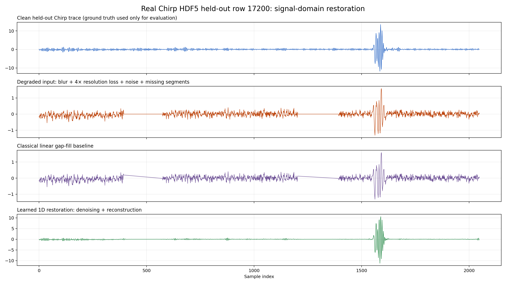
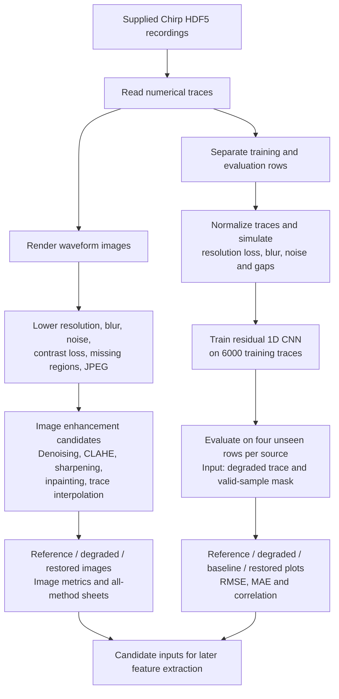
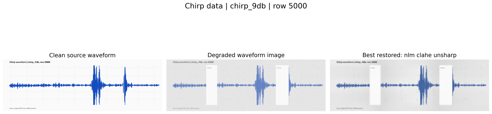
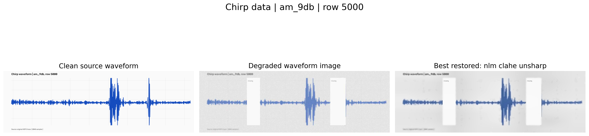
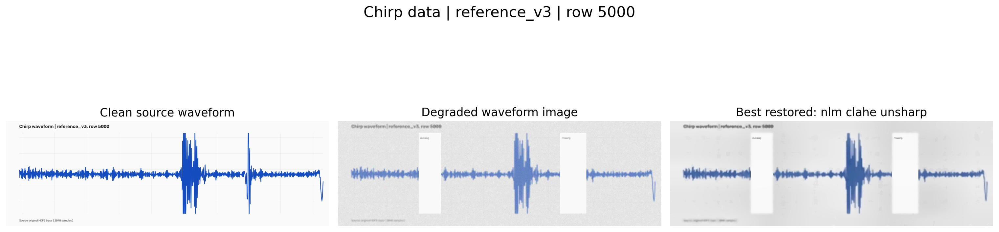
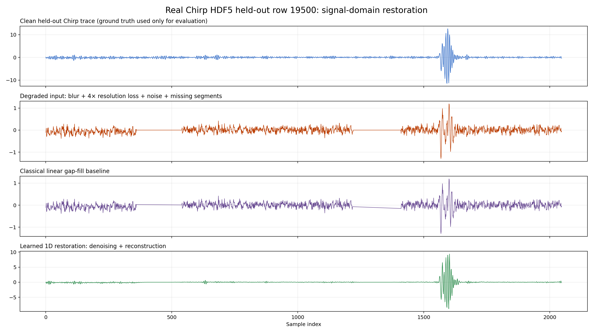
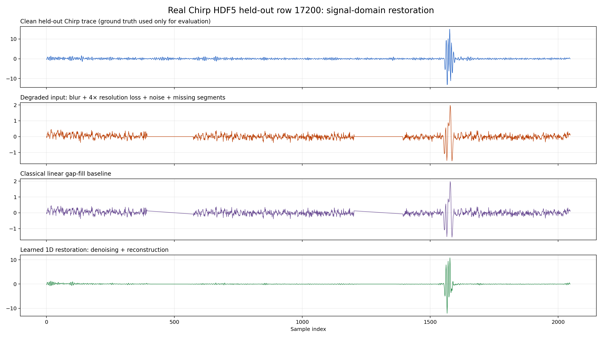

# Initial Chirp Experiments — Image Filters and Short-Context CNN

These earlier experiments are preserved as the development record. The [main README](README.md) now features a dedicated missing-region benchmark with gap-specific metrics, wider-context reconstruction and a direct image-input experiment. The results below have not been replaced or relabelled as complete gap recovery.

**Primary project:** enhance blurred, noisy, low-resolution, and incomplete waveform images for later feature extraction. The intended biomedical setting provides optical and thermal waveform images without a clean reference at deployment. The current implementation and results use the supplied **Chirp HDF5 recordings**.

[Formal project write-up](PROJECT_WRITEUP.md) · [Data and reproduction guide](CHIRP_DATA_RUN.md) · [All Chirp results](outputs/chirp/)

## Featured result: learned restoration on a real Chirp trace

The panel below shows the original reference, deliberately degraded input, linear interpolation baseline, and learned reconstruction for a trace excluded from training.



For this example, waveform correlation increases from **0.125 to 0.931** and normalized RMSE decreases from **0.993 to 0.376**. The learned model restores much of the prominent pulse structure. The long missing intervals remain largely flat: this result demonstrates improved overall waveform agreement, not complete recovery of the erased waveform.

The saved plots use separate vertical scales; compare the axis values as well as the shapes. All four evaluated rows per source, including weaker outcomes, are linked below.

## Motivation and scope

Blur, noise, reduced resolution, and missing regions can obscure the structure needed to trace a waveform or measure its features. The project tests whether image enhancement and signal reconstruction can make these inputs more usable.

The assigned application involves optical and thermal biomedical waveforms. The supplied Chirp files contain numerical traces; their interpretation as synchronized optical–thermal biomedical pairs has **not been established**. They currently provide a real-data test case for the restoration workflow.

In a real deployment, the clean reference would be unavailable. For Phase 1, an original recording is retained as an experimental reference and a copy is deliberately degraded. “Reference” here means the recording before our added degradation; it is not certified noise-free ground truth.

## Aim and objectives

- Build a reproducible enhancement workflow for flawed waveform images.
- Simulate resolution loss, blur, noise, weak contrast, compression, and missing regions.
- Compare denoising, contrast correction, sharpening, inpainting, and trace interpolation.
- Investigate learned waveform reconstruction when numerical samples are available.
- Produce before/after images and numerical comparisons for every evaluated example.
- Prepare for later feature extraction and validation on paired biomedical recordings.

## Methodology and architecture

Two implemented branches address different inputs: a raster branch processes images rendered from the recordings; a learned branch processes the numerical waveforms directly.



The 1D model currently requires numerical samples and a supplied missing-sample mask. Applying it directly to a supplied waveform screenshot would require an additional validated trace-extraction step.

## Experiments and what they showed

| Stage | Implementation | Observation |
|---|---|---|
| 1. Image baseline | Render real HDF5 rows and apply mixed degradation | Creates repeatable blurry, noisy, incomplete waveform images |
| 2. Filtering | Gaussian, median, bilateral and Non-Local Means (NLM) | Tests smoothing against preservation of thin waveform detail |
| 3. Contrast and sharpening | CLAHE combinations and unsharp masking | NLM + CLAHE + unsharp gives the highest mean image SSIM among tested methods for AM and Chirp |
| 4. Image gap repair | Mask-assisted Telea inpainting and image-trace interpolation | Produces repair candidates; image similarity alone does not verify the missing signal |
| 5. Numerical baseline | Linear interpolation across known gaps | Similar overall error to the degraded signal in the measured runs |
| 6. Learned reconstruction | Residual 1D convolutional neural network (CNN) | Improves overall waveform RMSE and correlation on the evaluated rows; long gaps remain a limitation |

Increasing pixel dimensions through interpolation is part of the image baseline. The learned branch uses 4× downsampled/upsampled signals during corruption; it predicts a signal on the original sample grid. Dedicated neural image super-resolution on Chirp images remains future work.

## Image enhancement: before and after

Each panel shows **original rendered waveform → degraded image → highest-SSIM tested restoration**. Selection uses the experimental reference, so these panels are retrospective comparisons rather than an automatic method-selection solution for reference-free deployment.

### Chirp 9 dB — row 5000



### AM 9 dB — row 5000



### V3 — row 5000



The image benchmark evaluates rows `500` and `5000` from each file:

| Source | Mean degraded image SSIM | Best tested method by mean SSIM | Mean restored image SSIM |
|---|---:|---|---:|
| AM 9 dB | 0.649 | NLM + CLAHE + unsharp | 0.739 |
| Chirp 9 dB | 0.657 | NLM + CLAHE + unsharp | 0.736 |
| V3 | 0.611 | Mask-assisted Telea inpainting | 0.718 |

This code uses a **global SSIM calculation** in `src/pipeline.py`. Image scores include plot backgrounds and labels; they do not measure only the trace or the erased regions.

[All six before/after panels](outputs/chirp/raster_enhancement/featured_before_after/) · [Every method on every example](outputs/chirp/raster_enhancement/all_methods/) · [Per-waveform metrics](outputs/chirp/raster_enhancement/metrics_per_waveform.csv) · [Aggregate image metrics](outputs/chirp/raster_enhancement/metrics_summary.csv)

## Learned reconstruction: results across every evaluated row

Each source has a separate model trained on 6,000 rows sampled from indices `0–14999`. Evaluation uses rows `16000`, `17200`, `18400`, and `19500` from the same file. This is a row holdout, not a subject or recording holdout.

The following values are averages across all four evaluated traces per source. RMSE measures sample error (lower is better); correlation measures waveform agreement (higher is better). RMSE is in normalized signal units.

| Source | Method | Mean RMSE ↓ | Mean correlation ↑ |
|---|---|---:|---:|
| Chirp 9 dB | Degraded input | 0.991 | 0.131 |
| Chirp 9 dB | Linear gap interpolation | 0.992 | 0.128 |
| Chirp 9 dB | Learned residual CNN | **0.507** | **0.852** |
| AM 9 dB | Degraded input | 0.971 | 0.238 |
| AM 9 dB | Linear gap interpolation | 0.972 | 0.233 |
| AM 9 dB | Learned residual CNN | **0.691** | **0.720** |

These are whole-trace metrics. They do not establish accurate reconstruction inside each missing interval. The benchmark normalizes each original trace before generating its corrupted copy and supplies the synthetic gap mask. Testing normalization from observed samples and automatically finding gaps are still needed for naturally degraded inputs.

### Another Chirp example — row 19500



### AM example — row 17200



| Evaluated row | Chirp 9 dB result | AM 9 dB result |
|---|---|---|
| 16000 | [View](outputs/chirp/learned_signal_restoration/chirp_9db/row_16000_signal_restoration.png) | [View](outputs/chirp/learned_signal_restoration/am_9db/row_16000_signal_restoration.png) |
| 17200 | [View](outputs/chirp/learned_signal_restoration/chirp_9db/row_17200_signal_restoration.png) | [View](outputs/chirp/learned_signal_restoration/am_9db/row_17200_signal_restoration.png) |
| 18400 | [View](outputs/chirp/learned_signal_restoration/chirp_9db/row_18400_signal_restoration.png) | [View](outputs/chirp/learned_signal_restoration/am_9db/row_18400_signal_restoration.png) |
| 19500 | [View](outputs/chirp/learned_signal_restoration/chirp_9db/row_19500_signal_restoration.png) | [View](outputs/chirp/learned_signal_restoration/am_9db/row_19500_signal_restoration.png) |

[Chirp numerical results](outputs/chirp/learned_signal_restoration/chirp_9db/heldout_metrics.csv) · [AM numerical results](outputs/chirp/learned_signal_restoration/am_9db/heldout_metrics.csv)

## How the learned method works

The network receives two channels: the corrupted waveform and a mask marking observed samples. Five convolutional layers learn a correction that is added to the input. Training compares the prediction with the original training trace, weighting missing samples four times as heavily as visible samples.

The implementation uses 14 epochs, batches of 64, AdamW with learning rate `0.002`, and random seed `29`. The model receives no evaluation target in its forward pass. Full details are in [run_chirp_learned_restoration.py](run_chirp_learned_restoration.py).

## Run on a laptop

Run these commands from the repository root:

```powershell
python -m pip install -r requirements.txt
python run_chirp_enhancement.py
python run_chirp_learned_restoration.py --source chirp_9db
python run_chirp_learned_restoration.py --source am_9db
```

Both scripts currently read data from `C:\Users\DELL\Desktop\hs lit theiory\Chirp data`. On another machine, set `DATA_ROOT` near the top of each script to the folder containing the three HDF5 files. The raw files are local inputs and are not included in this repository.

Re-running writes results to `Chirp_enhancement_results` inside that data folder. The figures and CSVs under `outputs/chirp/` are committed snapshots of the existing runs, available to browse without the raw data. Training also saves a model checkpoint locally.

The learned runner supports `--source v3`; a V3 learned run is not included in the current evidence. Its raster image results are included above.

## Project layout

```text
README.md                         Primary project, visuals and results
PROJECT_WRITEUP.md                Title, motivation, objectives and methodology
CHIRP_DATA_RUN.md                 Dataset details and reproduction guide
run_chirp_enhancement.py          Chirp waveform-image experiments
run_chirp_learned_restoration.py  Numerical waveform reconstruction
src/pipeline.py                   Shared classical methods and image metrics
outputs/chirp/                   Published Chirp figures and CSV results
requirements.txt                 Shared Python dependencies
additional_experiments/
  optical_thermal_benchmark/     Earlier work outside the assigned task
```

## Next steps toward the intended application

- Evaluate longer and differently positioned gaps with separate masked-region metrics.
- Test on unseen recordings and naturally degraded signals.
- Validate trace extraction when only an image is available.
- Obtain synchronized optical–thermal biomedical data and evaluate both modalities.
- Measure whether enhancement improves downstream waveform feature accuracy.

Density and Young's modulus remain downstream research goals. Estimating them requires a suitable physical model, calibration, and independent measurements; the current enhancement pipeline does not calculate these properties.

## Additional exploratory work

The earlier RGB–thermal benchmark and synthetic optical/thermal waveform demos are preserved in [additional_experiments/optical_thermal_benchmark/](additional_experiments/optical_thermal_benchmark/). They are additional experiments outside the assigned task, with their original methods, data samples, notebook, and result galleries.
