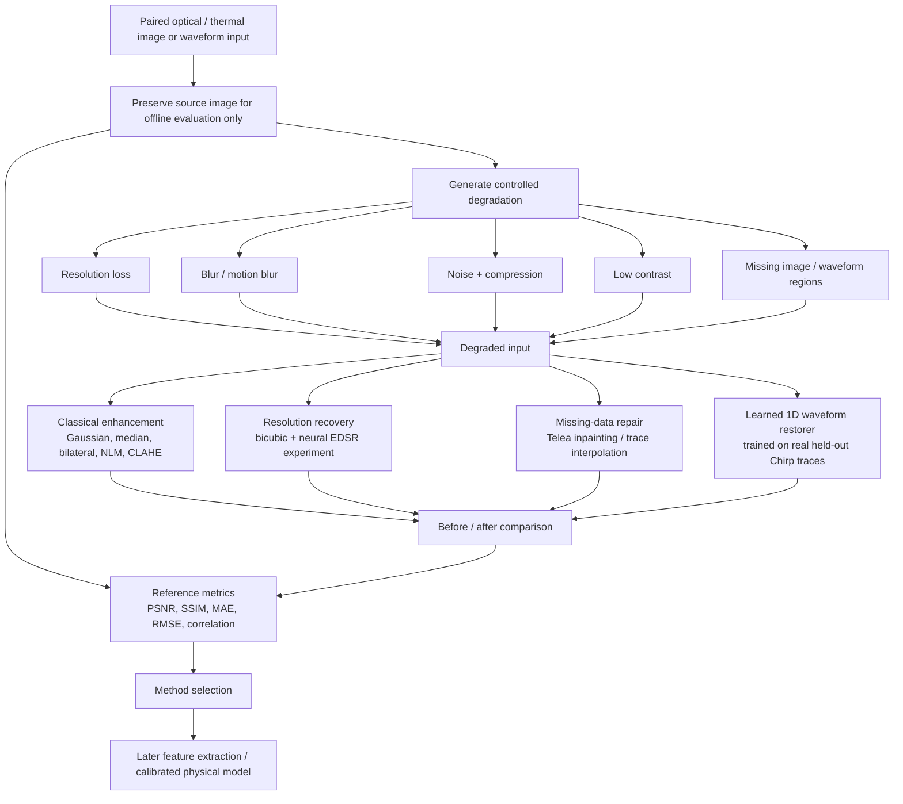

# Title

**Robust Enhancement and Missing-Data Reconstruction for Optical and Thermal Biomedical Waveform Images**

## Motivation / Background

Optical and thermal waveform images are increasingly relevant to non-contact biomedical monitoring. They can carry useful physiological and structural information, but real acquisitions may suffer from low sensor resolution, blur, noise, low contrast, compression artifacts, occlusion, and missing image regions. In the intended deployment setting, a corresponding clean ground-truth image is not available.

This makes the task more difficult than ordinary image filtering. An enhancement method must improve the usability of the acquired image without inventing misleading signal structure. The practical motivation is to make waveform/image data more suitable for later feature extraction, such as waveform morphology, intensity statistics, thermal gradients, region boundaries, density-related proxies, or inputs to a separately calibrated Young’s-modulus estimation model.

Because clean ground truth is unavailable in real deployment, Phase 1 uses a controlled-degradation protocol: preserve a clean source only for offline evaluation, generate known degradations, restore the degraded copy, and quantify how much structure is recovered. This provides a defensible way to select methods before applying them to naturally flawed images.

## Aim / Objectives

- Develop a reproducible image-enhancement workflow for optical and thermal waveform/image data.
- Simulate realistic acquisition failures: lower resolution, blur, noise, low contrast, JPEG artifacts, and missing regions.
- Evaluate multiple classical restoration techniques instead of assuming one filter is universally best.
- Test super-resolution and learned restoration approaches in addition to conventional filtering.
- Reconstruct missing waveform/signal regions using explicit, clearly labelled estimation methods.
- Compare clean, degraded, and restored outputs visually and with objective quality metrics.
- Select the least aggressive restoration method that preserves meaningful image or waveform structure.
- Create outputs that are directly usable for downstream feature-extraction experiments.
- Clearly document limitations: visually filled or model-estimated content is not equivalent to verified source truth.

## Brief Methodology

### Step-by-step workflow

1. **Input preparation**
   - Use optical, thermal, or waveform-image data.
   - Preserve the clean signal/image only during experimentation; do not provide it to a restoration method.

2. **Controlled degradation**
   - Reduce resolution and resize to emulate a low-resolution sensor.
   - Apply Gaussian or motion blur.
   - Reduce contrast and brightness.
   - Add random sensor-like noise and JPEG compression.
   - Remove known regions to emulate dropped samples, occlusion, or incomplete acquisition.

3. **Restoration experiments**
   - Apply Gaussian, median, bilateral, and Non-Local Means denoising.
   - Compare contrast-enhancement combinations using CLAHE.
   - Apply unsharp masking cautiously for edge recovery.
   - Test missing-area inpainting and waveform trace interpolation.
   - Test EDSR neural super-resolution as an exploratory generic neural baseline.
   - Train a 1D residual CNN on real Chirp waveform data with a strict train/held-out split for numerical waveform reconstruction.

4. **Evaluation**
   - Generate direct clean → degraded → restored visual panels.
   - Score image outputs with PSNR, SSIM, MAE, and RMS contrast.
   - Score numerical waveform reconstruction using RMSE, MAE, and waveform correlation.
   - Retain all attempts, including weak methods, to show why a chosen method is preferred.

5. **Selection and next stage**
   - Select the best method per degradation type rather than using a single fixed filter.
   - Use the selected restored output as a candidate for feature extraction.
   - Validate any density, Young’s-modulus, or other biomedical-property estimator against independent labelled/calibrated measurements.

## Current Phase 1 Work Completed

| Work package | Current implementation |
|---|---|
| Real optical–thermal image benchmark | Six real RGB/thermal ULB17-VT image triplets, three degradation profiles, 36 comparison sheets |
| Image restoration | Gaussian, median, bilateral, conservative NLM, NLM+CLAHE, NLM+CLAHE+unsharp, and Telea inpainting |
| Resolution recovery | Bicubic baseline and pre-trained EDSR ×2 neural super-resolution experiment |
| Missing waveform experiment | Synthetic optical/thermal waveform-image degradation, trace interpolation, inpainting, and periodic-template repair |
| Chirp HDF5 data adaptation | Real HDF5 waveform traces rendered as images, degraded, restored, and scored |
| Learned signal reconstruction | Residual 1D CNN trained on 6,000 real Chirp traces; evaluated only on held-out rows |
| Evidence | Direct before/after panels, all-method sheets, individual results, CSV metrics, and reproducible scripts |

### Held-out reconstruction evidence

The learned waveform-restoration experiment uses a strict row split: 6,000 traces sampled from rows `0–14999` are used for training and four rows (`16000`, `17200`, `18400`, `19500`) are held out completely for testing. The clean held-out trace is used only after inference to calculate the metrics below.

| Real Chirp source | Degraded RMSE ↓ | Learned-restoration RMSE ↓ | Degraded correlation ↑ | Learned-restoration correlation ↑ |
|---|---:|---:|---:|---:|
| Chirp 9 dB | 0.991 | 0.507 | 0.131 | 0.852 |
| AM 9 dB | 0.971 | 0.691 | 0.238 | 0.720 |

The learned method improves the test-set waveform agreement substantially over the deliberately degraded input. The model output remains an estimate, particularly inside masked spans; it must not be presented as verified source truth in a real deployment.

## Key Technical Insight

There are two different recovery problems:

1. **Enhancement of information that is still present**: denoising, blur reduction, contrast correction, and super-resolution may improve readability and preserve boundaries or waveform morphology.
2. **Estimation of information that is absent**: a blank/missing region cannot be truthfully recovered by a filter alone. Inpainting or learned reconstruction produces an estimate based on observed context and a learned signal prior. Such content must be labelled as estimated and independently validated before biomedical interpretation.

## Proposed Next Phase

- Obtain a biomedical dataset containing synchronized optical and thermal recordings and independent reference labels.
- Split data by subject/recording before model selection to prevent leakage.
- Train modality-aware restoration models only on training data.
- Evaluate restoration on held-out subjects and naturally degraded samples.
- Quantify the impact of restoration on downstream feature extraction.
- Pair images with independent density, elastography, or mechanical-test data before attempting density or Young’s-modulus inference.

## Scope and Responsible Interpretation

This project is an image/signal-restoration and quality-improvement framework. It does not directly calculate density or Young’s modulus. Those properties require an additional calibrated physical or machine-learning model and validated reference measurements.
