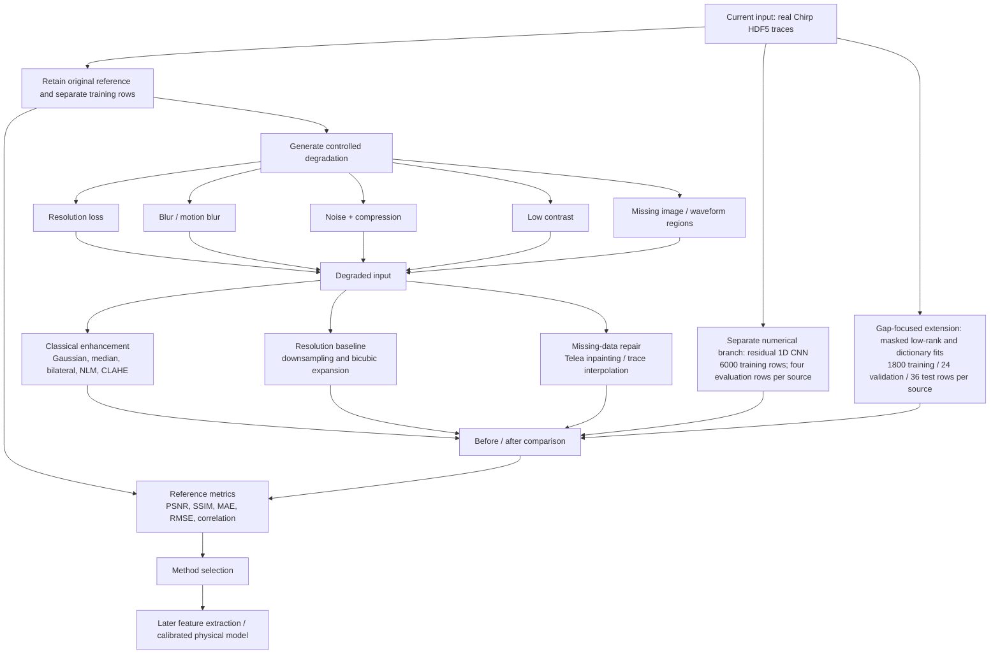

# Title

**Robust Enhancement and Missing-Data Reconstruction for Optical and Thermal Biomedical Waveform Images**

This is the **primary assigned project**. The current implementation uses the supplied Chirp HDF5 recordings as a real-data restoration test case. The earlier RGB–thermal benchmark and synthetic waveform demos are [additional exploratory work](additional_experiments/optical_thermal_benchmark/README.md), outside the assigned task.

The latest extension specifically evaluates missing-region recovery using 18 configurations, separate validation rows, and a direct image-input experiment. See [GAP_RECONSTRUCTION.md](GAP_RECONSTRUCTION.md) for its protocol and the [main README](README.md) for the current visual results. The earlier image-filter and CNN experiments are retained as development evidence.

## Motivation / Background

Optical and thermal waveform images are increasingly relevant to non-contact biomedical monitoring. They can carry useful physiological and structural information, but real acquisitions may suffer from low sensor resolution, blur, noise, low contrast, compression artifacts, occlusion, and missing image regions. In the intended deployment setting, a corresponding clean ground-truth image is not available.

This makes the task more difficult than ordinary image filtering. An enhancement method must improve the usability of the acquired image without inventing misleading signal structure. The practical motivation is to make waveform/image data more suitable for later feature extraction, such as waveform morphology, intensity statistics, thermal gradients, region boundaries, density-related proxies, or inputs to a separately calibrated Young’s-modulus estimation model.

Because clean ground truth is unavailable in real deployment, Phase 1 uses a controlled-degradation protocol: retain an original recording as a reference, generate known degradations, restore the degraded copy, and quantify how much structure is recovered. The original recording may itself contain acquisition noise.

The supplied Chirp files contain numerical traces. Their identity as paired optical and thermal biomedical measurements has not been established. This phase demonstrates restoration on those traces and their rendered images; validation on synchronized biomedical optical–thermal recordings remains a next step.

## Aim / Objectives

- Develop a reproducible image-enhancement workflow for optical and thermal waveform/image data.
- Simulate realistic acquisition failures: lower resolution, blur, noise, low contrast, JPEG artifacts, and missing regions.
- Evaluate multiple classical restoration techniques instead of assuming one filter is universally best.
- Increase image dimensions through interpolation and investigate learned waveform reconstruction; evaluate dedicated neural image super-resolution in a later phase.
- Reconstruct missing waveform/signal regions using explicit, clearly labelled estimation methods.
- Compare clean, degraded, and restored outputs visually and with objective quality metrics.
- Select the least aggressive restoration method that preserves meaningful image or waveform structure.
- Create outputs that are directly usable for downstream feature-extraction experiments.
- Clearly document limitations: visually filled or model-estimated content is not equivalent to verified source truth.

## Brief Methodology

### Step-by-step workflow

1. **Input preparation**
   - Read the supplied Chirp recordings and render selected traces as waveform images.
   - Retain original references for controlled degradation and scoring. The model's prediction inputs are the corrupted numerical trace and its missing-sample mask.

2. **Controlled degradation**
   - Reduce resolution and resize to emulate a low-resolution sensor.
   - Apply Gaussian or motion blur.
   - Reduce contrast and brightness.
   - Add random sensor-like noise and JPEG compression.
   - Remove known regions to emulate dropped samples, occlusion, or incomplete acquisition.

3. **Restoration experiments**
   - Apply Gaussian, median, bilateral, and Non-Local Means denoising.
   - Compare contrast-enhancement combinations using CLAHE.
   - Apply unsharp masking cautiously for edge recovery.
   - Test missing-area inpainting and waveform trace interpolation.
   - Use interpolation to expand low-resolution images back to the original dimensions.
   - Train a 1D residual CNN on real Chirp waveform data using non-overlapping training and evaluation row indices for numerical waveform reconstruction.

4. **Evaluation**
   - Generate direct clean → degraded → restored visual panels.
   - Score image outputs with PSNR, the implemented global SSIM, MAE, and RMS contrast.
   - Score numerical waveform reconstruction using RMSE, MAE, and waveform correlation.
   - Retain all attempts, including weak methods, to show why a chosen method is preferred.

5. **Selection and next stage**
   - Compare the best measured method per condition. Reference-based ranking is retrospective; selection without a reference needs separate validation.
   - Use the selected restored output as a candidate for feature extraction.
   - Validate any density, Young’s-modulus, or other biomedical-property estimator against independent labelled/calibrated measurements.

## Current Phase 1 Work Completed

The dedicated gap benchmark adds short gaps, long gaps, mixed numerical damage, severe resolution loss and calibrated raster-image inputs. It measures error inside missing intervals separately from whole-trace error. For the raster condition, visible samples are extracted from actual corrupted pixels before restoration. The adapter assumes known trace colour, geometry, amplitude calibration and mask.

The 36 test rows per source are reused across conditions; this remains a within-recording evaluation. Method selection uses validation gap RMSE. A zero-fill winner or negligible improvement is reported as no demonstrated recovery. The earlier experiments below are still part of the completed work.

| Work package | Current implementation |
|---|---|
| Chirp HDF5 data adaptation | Three recordings; rows 500 and 5000 from each rendered as images, degraded, restored, and scored |
| Image restoration | Gaussian, median, bilateral, conservative NLM, CLAHE combinations, unsharp masking, Telea inpainting, and trace interpolation |
| Resolution baseline | 4× image downsampling followed by bicubic expansion |
| Learned signal reconstruction | Separate residual 1D CNNs for Chirp 9 dB and AM 9 dB; each trained on 6,000 rows and evaluated on four other rows |
| Published evidence | Six image before/after panels, six all-method sheets, eight numerical reconstruction plots, and four CSV files under [outputs/chirp](outputs/chirp/) |

The [main README](README.md) presents the visual results. EDSR and the earlier RGB–thermal and synthetic-waveform benchmarks are documented separately as additional work; they are not results of the current Chirp implementation.

### Earlier CNN reconstruction evidence

The learned waveform-restoration experiment uses non-overlapping rows: 6,000 traces sampled from rows `0–14999` are used for training and four rows (`16000`, `17200`, `18400`, `19500`) are reserved for evaluation. This split is within each file, not across subjects or recordings. Original traces are normalized before synthetic corruption; their normalized references are used for scoring, but are not model inputs during prediction.

| Real Chirp source | Degraded RMSE ↓ | Learned-restoration RMSE ↓ | Degraded correlation ↑ | Learned-restoration correlation ↑ |
|---|---:|---:|---:|---:|
| Chirp 9 dB | 0.991 | 0.507 | 0.131 | 0.852 |
| AM 9 dB | 0.971 | 0.691 | 0.238 | 0.720 |

These averages cover all four evaluated rows per source. The [Chirp CSV](outputs/chirp/learned_signal_restoration/chirp_9db/heldout_metrics.csv) and [AM CSV](outputs/chirp/learned_signal_restoration/am_9db/heldout_metrics.csv) contain the complete measurements and interpolation baseline.

The learned method improves overall waveform agreement over the deliberately degraded input. Long missing spans remain largely flat in the displayed results. Whole-trace scores do not establish recovery inside the gaps; masked-region evaluation remains necessary. The model output is an estimate.

## Key Technical Insight

There are two different recovery problems:

1. **Enhancement of information that is still present**: denoising, blur reduction, contrast correction, and super-resolution may improve readability and preserve boundaries or waveform morphology.
2. **Estimation of information that is absent**: a blank/missing region cannot be truthfully recovered by a filter alone. Inpainting or learned reconstruction produces an estimate based on observed context and a learned signal prior. Such content must be labelled as estimated and independently validated before biomedical interpretation.

## Proposed Next Phase

- Obtain a biomedical dataset containing synchronized optical and thermal recordings and independent reference labels.
- Split data by subject/recording before model selection to prevent leakage.
- Train modality-aware restoration models only on training data.
- Evaluate restoration on held-out subjects and naturally degraded samples.
- Extend the new gap-specific evaluation to unseen recordings, unknown masks and varied gap locations.
- Quantify the impact of restoration on downstream feature extraction.
- Pair images with independent density, elastography, or mechanical-test data before attempting density or Young’s-modulus inference.

## Scope and Responsible Interpretation

This project is an image/signal-restoration and quality-improvement framework. It does not directly calculate density or Young’s modulus. Those properties require an additional calibrated physical or machine-learning model and validated reference measurements.
