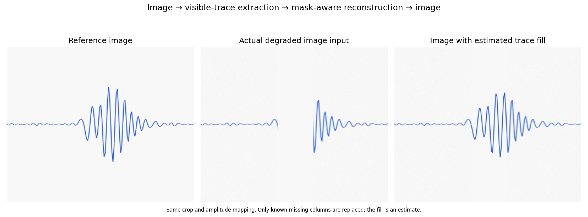
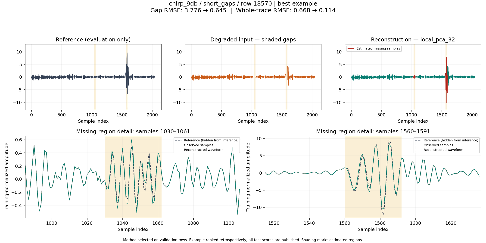
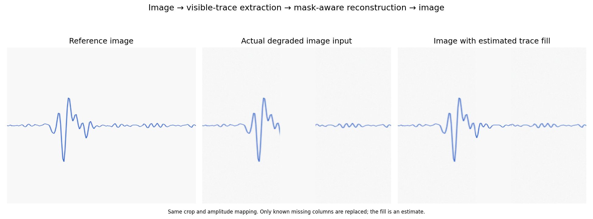
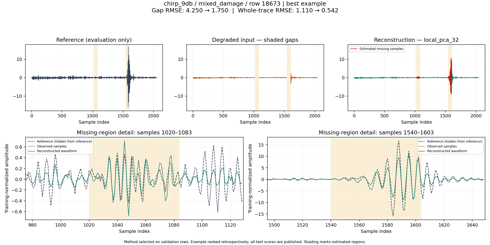
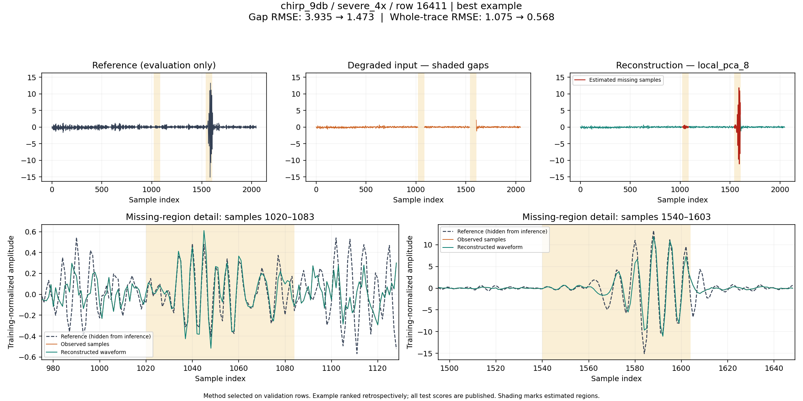
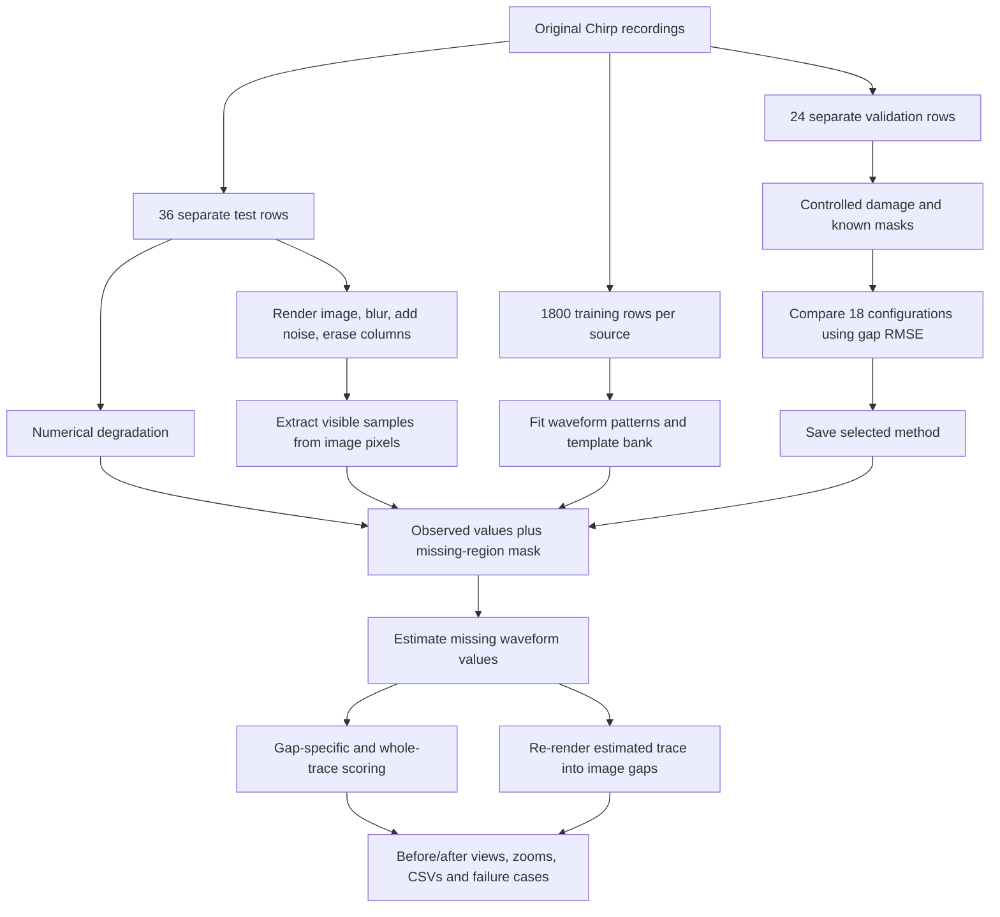

# BTP Phase 1 — Chirp Waveform Enhancement and Missing-Region Reconstruction

This project investigates restoration of blurred, noisy, low-resolution and incomplete waveform data using the supplied Chirp recordings. The latest experiment measures **error inside erased regions**, and includes an image-input pipeline that fills missing trace columns.

[Full methodology](GAP_RECONSTRUCTION.md) · [All current results](outputs/chirp/gap_reconstruction/) · [Review notebook](notebooks/chirp_gap_review.ipynb) · [Formal project write-up](PROJECT_WRITEUP.md)

## Actual image input → estimated missing-trace fill



This example starts with an image rendered from a real Chirp trace. Image blur, pixel noise and erased columns are applied. The pipeline extracts the remaining blue trace from the **image pixels**, estimates missing values using a training-derived local waveform basis, and renders those estimates into the missing columns.

The picture is a retrospectively selected best-case example. Across **all 36 Chirp test traces**, the image-input experiment reduces mean missing-region RMSE from **3.902 to 1.938 (50.3%)**. Individual outcomes vary; the full gallery includes typical and worst examples.

The image-input reconstruction improves gap RMSE on **33 of 36** Chirp traces; three become worse. The reported mean includes all of them.

[Full-resolution degraded image](outputs/chirp/gap_reconstruction/chirp_9db/raster_image/best_row16925/image_input.png) · [Enhanced image](outputs/chirp/gap_reconstruction/chirp_9db/raster_image/best_row16925/image_enhanced.png) · [Reference image](outputs/chirp/gap_reconstruction/chirp_9db/raster_image/best_row16925/image_reference.png) · [Gap-error close-ups](outputs/chirp/gap_reconstruction/chirp_9db/raster_image/best_row16925/comparison.png)

The current image adapter assumes known plot geometry, amplitude calibration, blue trace colour and a missing-region mask. Only missing columns are replaced in the final image; this is an estimated trace reconstruction, not recovery of the original hidden pixels. Arbitrary screenshots are not supported yet.

## Why this is different from the earlier results

The earlier CNN used an 81-sample receptive field while the simulated erased spans were 180–190 samples long. At the centre of those gaps, its prediction could not depend on any observed waveform value. Whole-trace correlation improved, but the long gaps remained mostly flat.

The new experiment:

- Compares **18 configurations** across interpolation, autoregression, low-rank reconstruction and training-trace dictionaries.
- Fits models on training rows and selects methods on separate validation rows.
- Measures missing-region error separately from visible-region and whole-trace error.
- Tests short gaps, long gaps, mixed blur/noise damage, 4× resolution loss and actual raster-image inputs.
- Publishes all test scores, with best, median-ranked and worst visual examples.

The old and new scores use different masks and normalization. They are not a head-to-head comparison of the old CNN against the new methods.

## Missing samples: reference versus prediction



The shaded regions were erased before inference. The zooms compare the reconstruction with the reference, which is used for scoring. This selected example has an **82.9% reduction in gap RMSE** relative to zero fill; the mean reduction over all 36 Chirp short-gap cases is **52.7%**.

Full-trace panels share the same vertical scale. Dashed references in the zooms make phase and amplitude errors visible instead of relying on a sharper-looking plot.

## Test results — all evaluated traces, not just the featured images

Each source contributes 36 distinct test traces, reused across five conditions. Methods are selected by **mean validation gap RMSE**, not by the best-looking test output. RMSE below is measured only in erased samples, in training-normalized units; lower is better.

| Source | Condition | Validation-selected method | Blank-gap RMSE | Reconstructed gap RMSE | Mean reduction |
|---|---|---|---:|---:|---:|
| Chirp 9 dB | Short gaps | Local PCA, rank 32 | 3.902 | 1.847 | 52.7% |
| Chirp 9 dB | Raster-image input | Local PCA, rank 32 | 3.902 | 1.938 | 50.3% |
| Chirp 9 dB | Blur + noise + 2× loss + gaps | Local PCA, rank 32 | 3.135 | 2.735 | 12.8% |
| Chirp 9 dB | Severe 4× loss + gaps | Local PCA, rank 8 | 3.135 | 2.669 | 14.9% |
| Chirp 9 dB | Long gaps | Autoregression | 2.457 | 2.454 | 0.1% |
| AM 9 dB | Short gaps | Local PCA, rank 32 | 4.485 | 3.547 | 20.9% |
| AM 9 dB | Raster-image input | Local PCA, rank 32 | 4.485 | 3.588 | 20.0% |
| AM 9 dB | Blur + noise + 2× loss + gaps | Autoregression | 3.274 | 3.267 | 0.2% |
| AM 9 dB | Severe 4× loss + gaps | Zero fill | 3.274 | 3.274 | 0.0% |
| AM 9 dB | Long gaps | Zero fill | 2.495 | 2.495 | 0.0% |
| V3 | Short gaps | Dictionary of 24 traces | 1.258 | 0.914 | 27.3% |
| V3 | Raster-image input | Dictionary of 48 traces | 1.258 | 0.860 | 31.7% |
| V3 | Blur + noise + 2× loss + gaps | Global PCA, rank 64 | 3.120 | 2.431 | 22.1% |
| V3 | Severe 4× loss + gaps | Global PCA, rank 64 | 3.120 | 2.646 | 15.2% |
| V3 | Long gaps | Global PCA, rank 64 | 2.526 | 2.515 | 0.4% |

Negligible gains and zero-fill selections are **no demonstrated useful recovery**, not successful restoration. Long missing intervals remain unresolved in important cases.

[Complete selected-method summary, including V3](outputs/chirp/gap_reconstruction/selected_test_summary.csv) · [Every validation and test measurement](outputs/chirp/gap_reconstruction/metrics.csv) · [All-method aggregate results](outputs/chirp/gap_reconstruction/summary.csv) · [Example selection and worst cases](outputs/chirp/gap_reconstruction/gallery.csv)

### Another source: V3 image-input reconstruction



This source selected a training-trace dictionary rather than local PCA. The overall image-input gap-error reduction is **31.7%** across 36 V3 traces; the image shown is a selected best-case illustration.

## Combined damage and resolution-loss examples

### Blur, noise, 2× resolution loss and missing samples



### 4× resolution loss and missing samples



These are selected best-case illustrations. Their cohort means are in the table above. Numerical resolution recovery uses a declared degradation operator and a learned prior; increasing image dimensions alone does not establish new measured detail.

## Approach and architecture



The low-rank methods learn recurring waveform patterns from training traces. They fit a combination of those patterns to the visible part of a damaged trace, then use the fitted combination to estimate its missing part. Dictionary methods instead combine similar training examples. Details, assumptions and the fitting equation are in [GAP_RECONSTRUCTION.md](GAP_RECONSTRUCTION.md).

## What was tried

| Family | Tested variants |
|---|---|
| Simple baselines | Zero fill, linear interpolation, PCHIP interpolation |
| Local signal prediction | Bidirectional autoregression |
| Global waveform basis | Five PCA rank/regularization settings |
| Global template fitting | One template; dictionaries of 8, 24 and 48 traces |
| Local waveform basis | PCA ranks 8, 16 and 32 |
| Local template fitting | Dictionaries of 8 and 24 traces |

[All configurations on the same fixed Chirp test row](outputs/chirp/gap_reconstruction/chirp_9db/short_gaps/all_methods_row16000.png)

The earlier Gaussian/median/bilateral/NLM filters, CLAHE, sharpening, inpainting and CNN work remain documented in [CHIRP_INITIAL_EXPERIMENTS.md](CHIRP_INITIAL_EXPERIMENTS.md).

## Reproduce on a laptop

```powershell
python -m pip install -r requirements-gap.txt
python -m unittest discover -s tests -v
python run_chirp_gap_benchmark.py --data-root "C:\Users\DELL\Desktop\hs lit theiory\Chirp data"
python render_chirp_gap_report.py
python verify_chirp_gap_results.py
```

Use your own data-folder path after `--data-root`. The three original HDF5 files remain local inputs. This CPU pipeline uses no PyTorch and does not modify the recordings.

The pinned environment was run with Python 3.14. For a notebook interface, install `notebook` and run `python -m notebook notebooks/chirp_gap_review.ipynb`.

To inspect the published results without the raw files:

- Open the [review notebook](notebooks/chirp_gap_review.ipynb); its optional rerun is off by default.
- Download and open [the HTML gallery](outputs/chirp/gap_reconstruction/index.html) locally.
- Browse the PNG images and CSV files directly on GitHub.

The result folder includes full numerical prediction arrays, masks, split indices, code/training checksums and saved validation choices. All figure generation can be repeated from those saved predictions.

## Current evidence and limits

The benchmark contains 108 distinct test traces, 540 trace/condition cases and 9,720 test-method measurements. The report provides 45 best/median/worst comparison panels, 15 fixed-row all-method sheets, and nine raster-image before/after views with separate original/input/enhanced PNGs.

The recordings have not been established as synchronized optical–thermal biomedical pairs. This is a within-recording, controlled-degradation experiment with known masks; it does not validate unseen subjects, arbitrary screenshots, unknown blur, or complete long-gap recovery.

The intended next stage is to evaluate varied gap positions and unseen recordings, then assess downstream feature accuracy. Density and Young's modulus require additional physical modelling, calibration and independent measurements; this project does not currently estimate them.

## Repository layout

```text
run_chirp_gap_benchmark.py         Fit, validate and evaluate current methods
render_chirp_gap_report.py         Rebuild figures and local HTML gallery
src/chirp_gap.py                   Mask-aware numerical restoration
src/chirp_raster.py                Calibrated image input and trace extraction
tests/test_chirp_gap.py            Reconstruction and data-isolation checks
verify_chirp_gap_results.py        Independent saved-result and selection audit
notebooks/chirp_gap_review.ipynb   Review and optional full rerun
outputs/chirp/gap_reconstruction/  Current results, predictions and figures
GAP_RECONSTRUCTION.md              Detailed methodology and limitations
CHIRP_INITIAL_EXPERIMENTS.md        Earlier Chirp filters and short-context CNN
additional_experiments/           Earlier optical–thermal exploratory work
```
