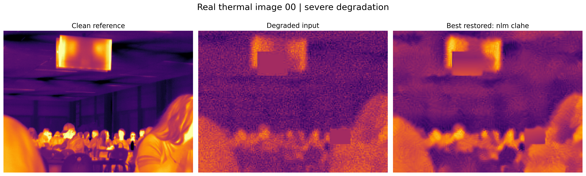
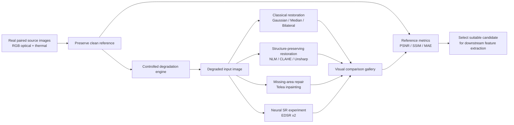
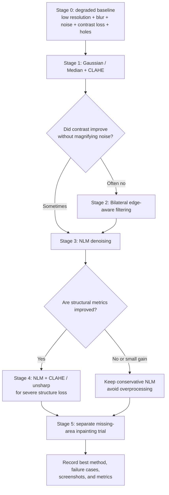
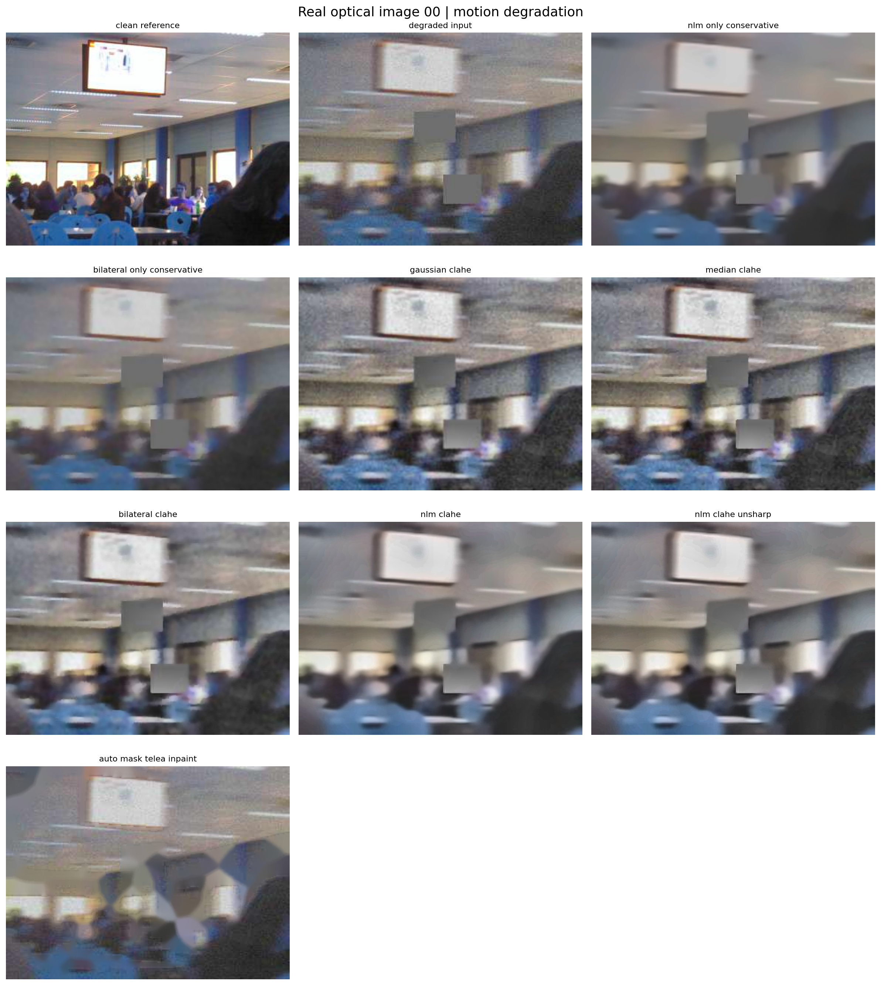
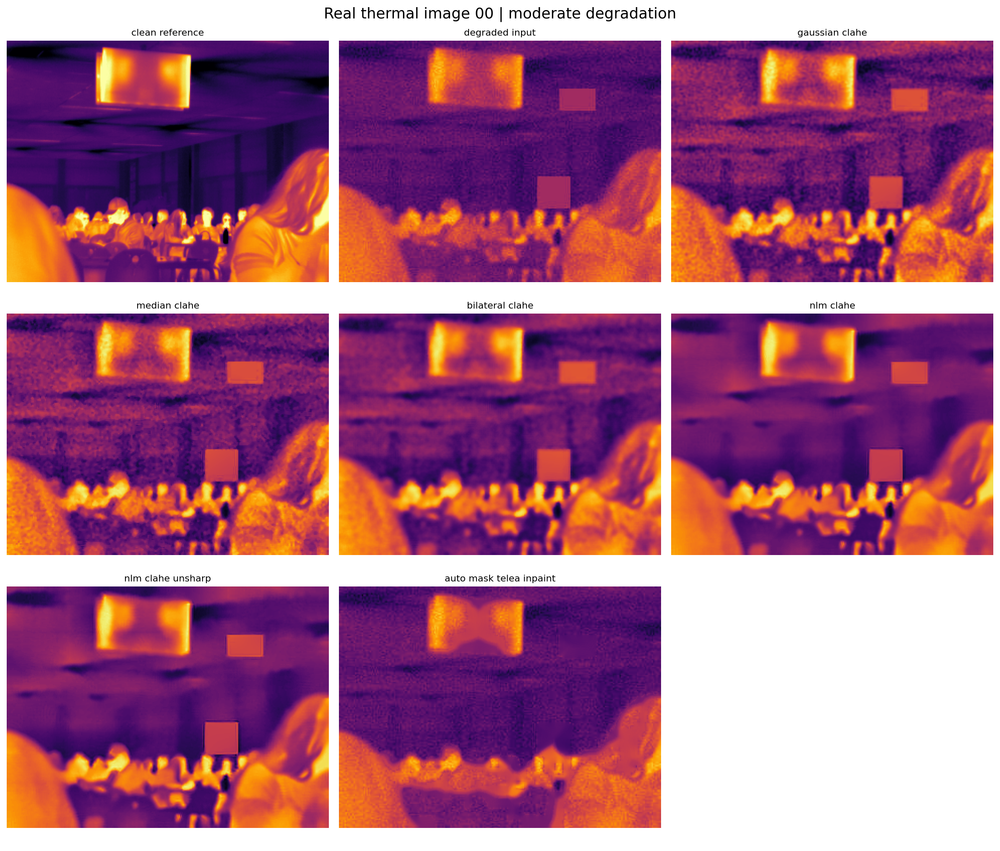
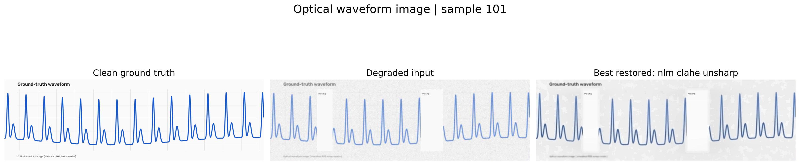
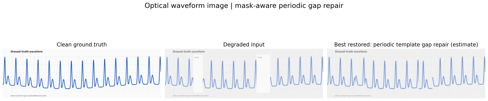

# BTP Phase 1 — Optical–Thermal Image Restoration Benchmark

> A reproducible Phase 1 investigation of how image degradation affects paired optical and thermal imagery, and how classical restoration, inpainting, and neural super-resolution can recover usable visual structure for downstream feature extraction.



## Why this project

Biomedical optical and thermal images may be affected by limited sensor resolution, defocus or motion blur, low contrast, sensor noise, compression, and incomplete image regions. These effects can make later tasks—region identification, boundary detection, temperature-pattern analysis, waveform tracing, and feature extraction—less reliable.

This Phase 1 work addresses the **image-quality layer** first:

```text
Clean paired image  ->  controlled realistic degradation  ->  restoration alternatives
                                                         ->  visual + objective comparison
                                                         ->  candidate input for later feature extraction
```

The goal is not to claim a clinical diagnostic or material-property estimate. It is to establish a careful, repeatable enhancement baseline and demonstrate which processing choices preserve image structure.

## System architecture



## Experiment progression: test, observe, refine

The work is structured as an investigation, not a one-shot filter application. Every stage is retained in the output gallery.



## What was implemented

### 1. Real paired optical–thermal data

The benchmark uses the public **ULB17-VT** dataset. Every selected example contains an aligned optical RGB image, a high-resolution thermal image (320×240), and a low-resolution thermal image (80×60). The repository includes a compact visible subset of six real aligned image triplets under `data/samples/ulb17_vt_test/`; the 512 MB original download is intentionally excluded from Git.

Dataset: [ULB17-VT on Zenodo](https://doi.org/10.5281/zenodo.2557535) · Related work: Almasri & Debeir, *Multimodal Sensor Fusion in Single Thermal Image Super-Resolution* (2018).

### 2. Controlled degradation suite

Each clean image is transformed into several reproducible failure cases.

| Degradation | Simulated failure |
|---|---|
| Resolution reduction | Low-resolution sensor acquisition / undersampling |
| Gaussian blur | Defocus and optical blur |
| Motion blur | Motion or camera shake |
| Contrast reduction | Weak thermal/optical separation |
| Additive noise | Sensor noise |
| JPEG compression | Transmission or storage artifacts |
| Missing patches | Occlusion, dropped pixels, or incomplete acquisition |

Three profiles are run on every real image: `moderate`, `severe`, and `motion`.

### 3. Broad restoration comparison

No single method is assumed to be best. All results are retained, including those that underperform.

| Family | Methods implemented | Purpose |
|---|---|---|
| Baseline | Bicubic interpolation | Reference for low-resolution upscaling |
| Denoising + local contrast | Gaussian+CLAHE, Median+CLAHE, NLM+CLAHE | Reduce noise and reveal local structure |
| Edge-aware processing | Bilateral+CLAHE, NLM+CLAHE+unsharp mask | Retain / emphasize boundaries |
| Missing-data repair | Automatic-mask Telea inpainting | Fill detected missing regions |
| Neural super-resolution | Pre-trained EDSR ×2 | Exploratory deep-learning super-resolution comparison |
| Waveform-specific recovery | Blind trace interpolation | Recover a missing plotted trace from neighbouring visible trace points |

`CLAHE` is Contrast Limited Adaptive Histogram Equalization. `NLM` is Non-Local Means denoising. `EDSR` is a real pre-trained residual neural super-resolution model; it is **not** a GAN and is labelled exploratory because it was trained on generic natural images, not biomedical images.

### 4. Quantitative evaluation

Because the clean image is retained before degradation, every restoration can be objectively scored.

| Metric | Meaning | Better result |
|---|---|---|
| PSNR | Pixel-level closeness to the clean reference | Higher |
| SSIM | Brightness, contrast, and structural similarity (0–1) | Higher |
| MAE | Mean absolute pixel error | Lower |
| RMS contrast | Visible intensity variation | Context-dependent; higher can mean noise |

Visual sharpness alone is never treated as proof of improvement. A method that looks sharper but decreases SSIM/PSNR is kept and reported as an informative failure case.

## Results and evidence

The current run uses six real RGB–thermal samples × two modalities × three degradation profiles.

- **36** screenshot-ready comparison sheets
- **36** large clean → degraded → best-restored before/after panels
- **288** standalone clean / degraded / enhanced image outputs
- Per-image and aggregate CSV metrics
- Six original visible image triplets committed under `data/samples/`

| Example evidence | Link |
|---|---|
| Real RGB + HR thermal + LR thermal source | [open](outputs/ulb17_vt/00_source_pair.png) |
| Real thermal image with severe degradation and every method | [open](outputs/real_image_enhancement/00_thermal_severe_comparison.png) |
| Real optical image with motion degradation and every method | [open](outputs/real_image_enhancement/00_optical_motion_comparison.png) |
| Per-image metrics | [open](outputs/real_image_enhancement/metrics_per_image.csv) |
| Aggregate metrics | [open](outputs/real_image_enhancement/metrics_summary.csv) |
| Visual before/after gallery | [open](outputs/real_image_enhancement/featured_before_after) |

### Best observed Phase 1 outcomes

The best method is chosen separately for the modality and degradation—not by visual preference alone.

| Case | Best evaluated method | Mean SSIM: degraded -> restored |
|---|---|---:|
| Optical, moderate degradation | NLM + CLAHE + unsharp | 0.841 -> 0.856 |
| Optical, motion degradation | NLM + CLAHE + unsharp | 0.792 -> 0.817 |
| Optical, severe degradation | NLM + CLAHE + unsharp | 0.636 -> 0.739 |
| Thermal, moderate degradation | Conservative NLM | 0.865 -> 0.868 |
| Thermal, motion degradation | Conservative NLM | 0.845 -> 0.848 |
| Thermal, severe degradation | NLM + CLAHE | 0.681 -> 0.766 |

The gains on moderate thermal inputs are intentionally reported as small. This is a useful finding: when an input is already structurally good, aggressive processing should not be expected to create a dramatic or trustworthy change.

### Method-by-method learning trail

| Step | What was tried | Observed result | Decision captured in repository |
|---:|---|---|---|
| 0 | Degraded baseline only | Severe blur/noise reduces thermal SSIM to 0.681; missing blocks remain | Baseline sheet and metrics saved |
| 1 | Gaussian+CLAHE and Median+CLAHE | More visible local contrast, but frequent noise amplification and lower fidelity in moderate thermal images | Kept as comparison, not default choice |
| 2 | Bilateral filtering | Smoother noise with edges partly retained; performance depends on degradation type | Retained as edge-aware baseline |
| 3 | Conservative NLM only | Best for moderate/motion thermal images: preserves signal without aggressive remapping | Preferred conservative setting for mild degradation |
| 4 | NLM+CLAHE and NLM+unsharp | Best structural recovery under severe degradation (thermal SSIM 0.681 → 0.766; optical 0.636 → 0.739) | Featured as severe-case candidate |
| 5 | Automatic-mask Telea inpainting | Can fill a region visually but is unable to verify original content | Explicitly reported as repair candidate, not truth recovery |
| 6 | Pre-trained EDSR neural SR | Added as a real neural-SR experiment for waveform-image rendering | Retained as exploratory; not claimed medically validated |

This progression is why the project includes methods that do not win: it documents informed elimination and shows why later choices were made.

### Selected visual evidence gallery

Each sheet always starts with the clean reference and degraded input, followed by **every** attempted restoration. The examples below deliberately cover different modalities and failure modes.

| Case | What to inspect | Result |
|---|---|---|
| [Optical / moderate](outputs/real_image_enhancement/00_optical_moderate_comparison.png) | Noise, low contrast, 2× loss, missing blocks | NLM+CLAHE variants improve traceability of scene boundaries but do not recreate blocked content. |
| [Optical / motion](outputs/real_image_enhancement/00_optical_motion_comparison.png) | Directional blur and compression | NLM+CLAHE+unsharp has highest mean SSIM within this condition. |
| [Thermal / moderate](outputs/real_image_enhancement/00_thermal_moderate_comparison.png) | Thermal noise and contrast loss | Conservative NLM is preferred: it reduces noise while avoiding excess contrast manipulation. |
| [Thermal / severe](outputs/real_image_enhancement/00_thermal_severe_comparison.png) | Strong blur, low resolution, noise, holes | NLM+CLAHE gives the best structural score, but holes remain an uncertainty rather than recovered truth. |





## Exact technical protocol

### Input preparation

The ULB17-VT pickle archive is read directly without changing its source arrays. For presentation and conventional image processing, each thermal image is mapped to an 8-bit display range using its own 1st–99th percentile range. The original raw thermal array is never overwritten. Optical RGB data remains in its native 8-bit three-channel form.

The visible subset uses fixed official test-set indices: `0, 7, 14, 23, 31, 40`. Fixed indices make visual examples and aggregate measurements repeatable.

### Degradation model

The degradation is deterministic for a sample/profile combination. It follows this ordered pipeline:

```text
clean image
  -> resize down (2× moderate/motion; 4× severe)
  -> bicubic resize to original dimensions
  -> Gaussian blur (moderate/severe) or 13-pixel horizontal motion kernel
  -> contrast/brightness reduction
  -> additive zero-mean Gaussian noise
  -> two rectangular missing-data blocks
  -> JPEG encode/decode (quality 48 moderate/motion; 24 severe)
```

This produces a mixed-degradation setting closer to practical image failures than applying a single filter benchmark. It also allows controlled ablation later: any individual step can be disabled or varied in `run_real_image_enhancement.py`.

### Restoration methods and parameters

| Method | Implementation details | Intended benefit | Failure mode to monitor |
|---|---|---|---|
| Bicubic baseline | OpenCV cubic interpolation | Reference for resizing | Cannot add lost detail |
| Gaussian+CLAHE | Gaussian sigma 0.8, CLAHE clip limit 2.0, 8×8 tiles | Mild smoothing and local contrast | Noise/false contrast boost |
| Median+CLAHE | 3×3 median, CLAHE | Remove impulse-like noise | Removes narrow detail |
| Bilateral+CLAHE | Diameter 7, sigma color/space 40, CLAHE | Smooth while protecting edges | Can alter thermal gradients |
| Conservative bilateral | Diameter 7, sigma color/space 35 | Edge-aware smoothing without contrast remapping | May retain fine noise |
| Conservative NLM | Fast NLM, strength 6 color/gray | Strong denoising with no CLAHE | May blur small features |
| NLM+CLAHE | Fast NLM plus CLAHE | Denoise and expose local structure | Can make noise appear as detail |
| NLM+CLAHE+unsharp | NLM+CLAHE, then 1.3 sigma unsharp mask | Sharper boundaries | Ringing / oversharpening |
| Automatic Telea inpainting | Candidate mask from flat grey missing regions, radius 5 | Fill known-like corrupt regions | Plausible fill is not recovered ground truth |

The waveform-image experiment adds **blind waveform interpolation** and real pre-trained **EDSR ×2 neural super-resolution**. Those experiments are separate and clearly marked exploratory.

### Why missing regions are treated differently

Blur and noise can often be reduced by filters because some local information remains. A completely blank/occluded patch contains no direct source information. Inpainting can create a visually continuous patch, but it must never be presented as verified anatomy, verified temperature, or verified waveform. The result should be displayed as an uncertainty-aware repair candidate and validated against another frame/sensor/reference wherever possible.

## How to read the outputs

### Comparison-sheet layout

```text
clean reference | degraded input | conservative methods | contrast methods | inpainting
```

- **Clean reference** is never given to the enhancement method.
- **Degraded input** is the only input a real restoration pipeline receives.
- **Remaining panels** are alternative outputs from exactly the same input.
- `metrics_per_image.csv` supplies the corresponding measured fidelity.

### File naming

`00_thermal_severe_comparison.png` means: test image index 00, thermal modality, severe degradation, one complete sheet of results. The `individual_outputs/` folder, kept locally, contains the same results as separate full-resolution images.

### Interpretation rules used in this project

1. Compare to the clean reference visually, then check PSNR/SSIM/MAE.
2. Prefer the least aggressive method that preserves the relevant structure.
3. Do not call a result “better” merely because its contrast is higher.
4. Treat inpainted pixels as estimated content, not source truth.
5. For radiometric thermal analysis, calculate temperature from raw calibrated values, not a contrast-enhanced display image.

## Running individual experiments

| Command | Produces |
|---|---|
| `python run_real_image_enhancement.py` | Main 36 real RGB/thermal comparison sheets and metrics |
| `python run_ulb17_benchmark.py` | Direct 80×60 → 320×240 thermal 4× super-resolution comparison |
| `python run_waveform_image_benchmark.py` | Paired waveform-image degradation, restoration, gap-repair demonstrations |
| `$env:RUN_EDSR_ALL=1; python run_waveform_image_benchmark.py` | EDSR neural SR on every waveform example; slower on CPU |
| `python export_real_samples.py` | Rebuilds the visible six-image source subset from downloaded archive |

## Extension to biomedical feature extraction

Phase 1 deliberately stops before making biomedical-property claims. A validated Phase 2 would use paired biomedical acquisition and independent reference values:

```text
raw optical + radiometric thermal frames
             -> enhancement selected on held-out data
             -> ROI / waveform / contour extraction
             -> calibrated feature model
             -> compare against independent physical reference
```

Candidate image-derived intermediate features include ROI intensity statistics, thermal gradients, hotspot area, boundary geometry, temporal waveform shape, and signal quality. Density and Young’s modulus are not image-enhancement outputs; their estimation requires a separately calibrated mechanical/biophysical model and ground-truth measurements.

## Reproducibility

### Requirements

```powershell
python -m pip install -r requirements.txt
```

### Run the real-image enhancement benchmark

The compact real samples are already present. This command regenerates all clean/degraded/restored results.

```powershell
python run_real_image_enhancement.py
```

Generated files:

```text
outputs/real_image_enhancement/
  00_thermal_severe_comparison.png
  00_optical_motion_comparison.png
  ...                                   # 36 visual comparison sheets
  individual_outputs/                   # 288 standalone images
  metrics_per_image.csv
  metrics_summary.csv
```

### Rebuild the visible data subset from the original archive

```powershell
curl.exe -L --output data\ULB17-VT.pkl "https://zenodo.org/records/2557535/files/ULB17-VT.pkl?download=1"
python export_real_samples.py
```

### Run the 4× thermal super-resolution comparison

```powershell
python run_ulb17_benchmark.py
```

### Run waveform-image recovery experiments

```powershell
python run_waveform_image_benchmark.py
```

This additional controlled experiment creates paired optical and thermal waveform-image renders, applies blur/noise/lower resolution/missing trace segments, then evaluates filters, inpainting, blind trace interpolation, and EDSR. It demonstrates how image restoration can support later waveform feature extraction. The waveform renders are synthetic demonstrations, explicitly separate from the real-image benchmark.

### Waveform-image recovery gallery

The waveform experiment gives a direct visual analogue of incomplete physiological traces: a clean waveform image is degraded, sections are erased, then several recovery strategies are tested. The featured panel selects the highest-SSIM output for that individual render; the all-method sheet preserves every trial.

| Optical waveform with missing trace regions | Thermal waveform with missing trace regions |
|---|---|
| [Before/after panel](outputs/waveform_images/featured_before_after/101_optical_before_after.png) | [Before/after panel](outputs/waveform_images/featured_before_after/101_thermal_before_after.png) |
| [All methods](outputs/waveform_images/101_optical_all_methods.png) | [All methods](outputs/waveform_images/101_thermal_all_methods.png) |
| [Missing-gap repair view](outputs/waveform_images/gap_repair_before_after/101_optical_gap_repair.png) | [Missing-gap repair view](outputs/waveform_images/gap_repair_before_after/101_thermal_gap_repair.png) |





The periodic-template gap-repair output assumes the trace repeats steadily and copies an adjacent observed cycle into a known missing interval. It can make a trace continuous for display or downstream candidate extraction, but it is an **estimate**, not verified ground truth. This limitation is especially important for irregular physiological rhythms.

## Repository layout

```text
data/samples/ulb17_vt_test/        # visible real RGB/thermal source images
src/pipeline.py                    # degradation-independent restorers and metrics
export_real_samples.py             # exports small real-image subset from public archive
run_real_image_enhancement.py      # main Phase 1 benchmark
run_ulb17_benchmark.py             # original LR thermal -> HR thermal 4× benchmark
run_waveform_image_benchmark.py    # missing-trace and waveform-image experiment
outputs/                           # figures and numerical evidence
DATA_AND_ETHICS.md                 # source, privacy, and radiometric-data safeguards
PROJECT_GUIDE.md                   # plain-language explanation
```

## Technical observations from Phase 1

1. Restoration is problem-dependent: one filter cannot be assumed to solve blur, noise, contrast loss, and missing data simultaneously.
2. Contrast enhancement can make an image more readable yet reduce fidelity to the clean reference. Therefore visual and numerical scoring are both required.
3. Generic inpainting can fill a hole but cannot guarantee that the recovered pixels represent true anatomy or thermal values.
4. Neural super-resolution is promising as an experiment, but a generic pre-trained model must not be presented as medically validated.
5. Raw radiometric thermal values must be retained for quantitative temperature analysis; contrast-enhanced images are display/segmentation aids unless separately validated.

## Next phase

The next step is to run this same protocol on a licensed biomedical RGB–thermal dataset with synchronized physiological ground truth, use subject-level separation, and evaluate downstream feature extraction against independent references. The image-restoration framework, output organization, and metrics are already in place.

## Responsible use

This code is for research and educational benchmarking. It is not a diagnostic device and does not directly infer density, Young’s modulus, or any clinical parameter. See [DATA_AND_ETHICS.md](DATA_AND_ETHICS.md).
